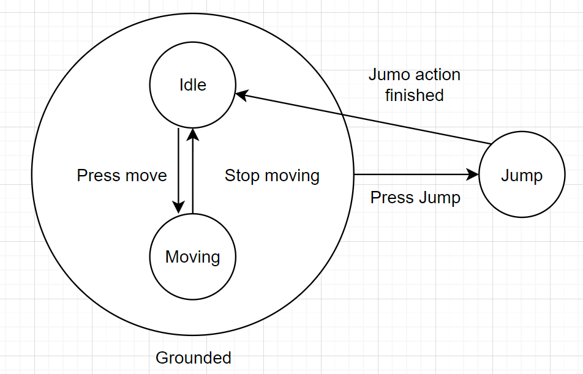

## Hierarchical FSM pattern

### The state patterns solves 2 problems:

1. An object should change its behavior when its internal state changes
2. State-specific behavior is defined independently. Adding new states does not impact the behavior of existing states.

### the state object

Each concrete state implement the `IState` interface:

- An entry: this logic executes when first entering the state.
- Update: runs at `Updata`, `FixedUpdate`...
- An Exit: Code here runs before leaving the state.

### The state machine

- manage how control flows enters and exists the states

### The Hierarchical design

- Some states share some common traits. e.g. moving and idle state are both on the ground, and can both enter the jump state. So we can have a OnTheGround state that moving and idle can inherited from.
  
